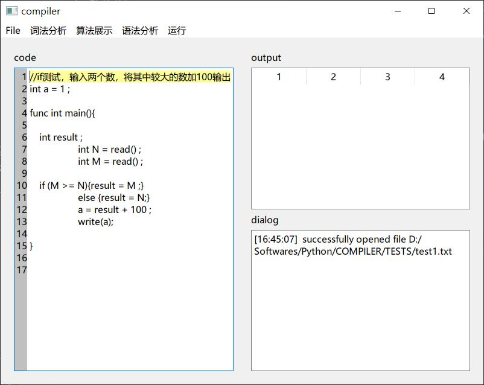
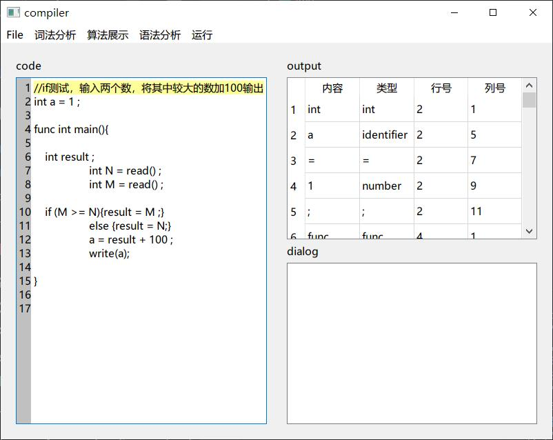
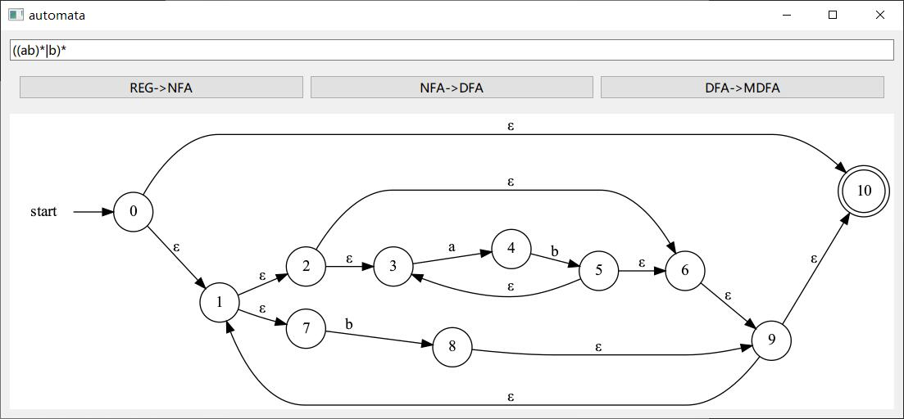
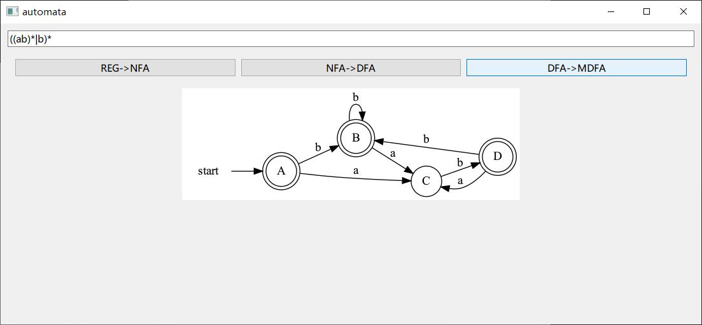
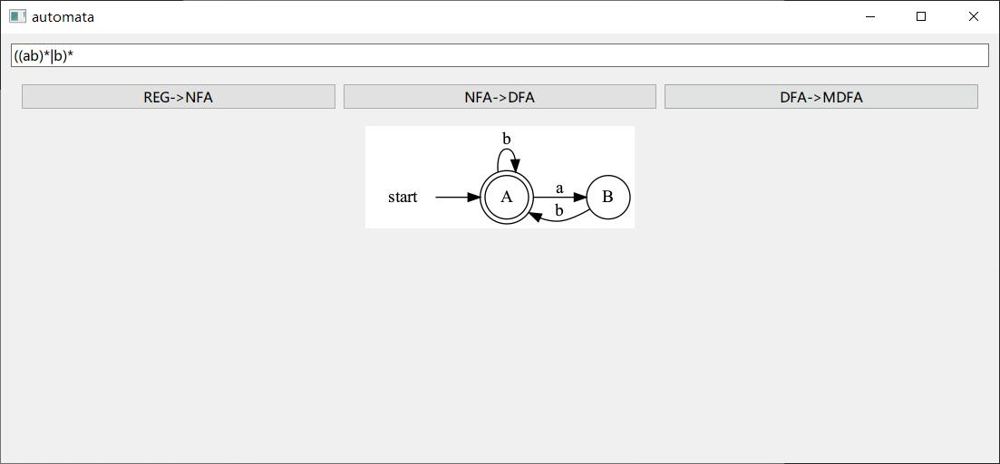
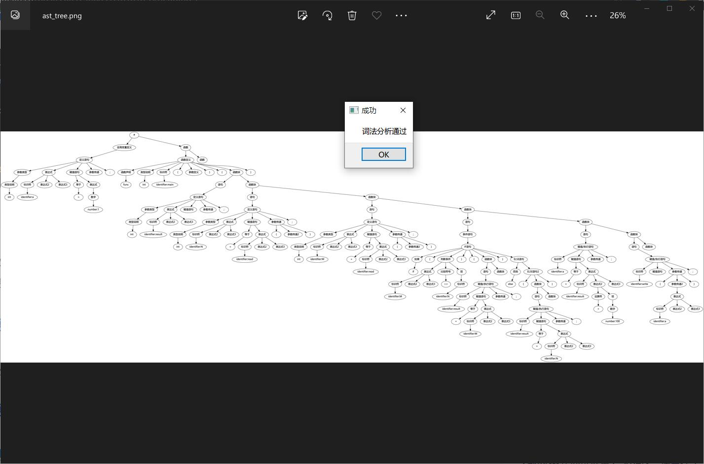
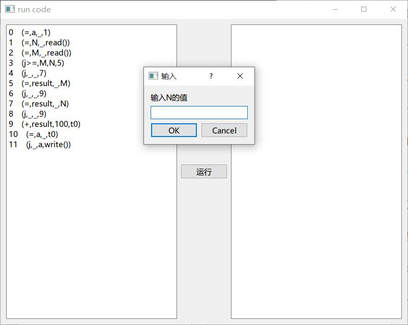
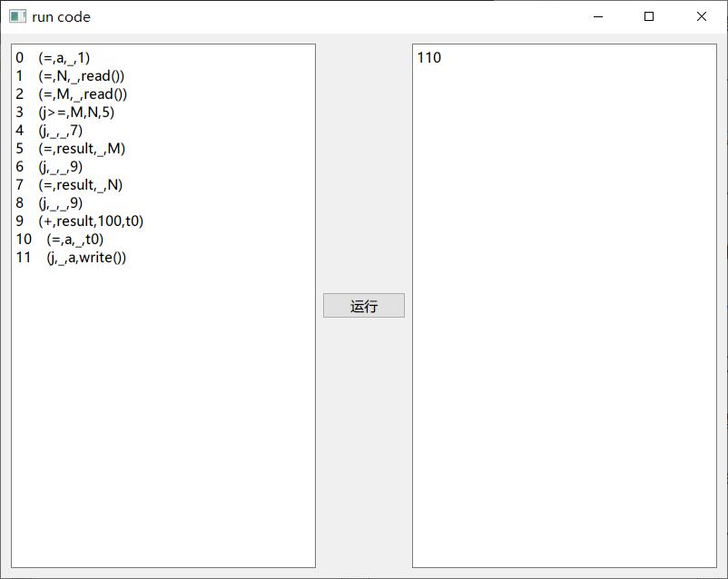

# 编译原理课程设计 - Sample语言（简化C语言）编译器

## 完成功能

* [X] 基于ply.lex的自动词法分析
* [X] 手动词法分析
* [X] 正规式转NFA转DFA转MDFA
* [X] LL(1)语法分析
* [X] 代码转四元式
* [X] 四元式解析器

1.啊这个写得真的很烂，一共有十个测试样例，其中可以过七个

2.很多功能没有做到特别完善，但是也肝了很久了

3.文法应该有些问题，应该是不支持多函数的

4.总之就很糊弄，不过做得时候也学到了很多就是了

5.因为做得很烂所以应该不会有更加详细的项目复盘（有点丢人就是说

## 界面展示

## 依赖环境
ply.lex用于自动词法分析

PyQt5用于可互动GUI

graphviz用于算法展示部分的画图

开发环境基于python 3.8.5

运行mainwindow.py即可~